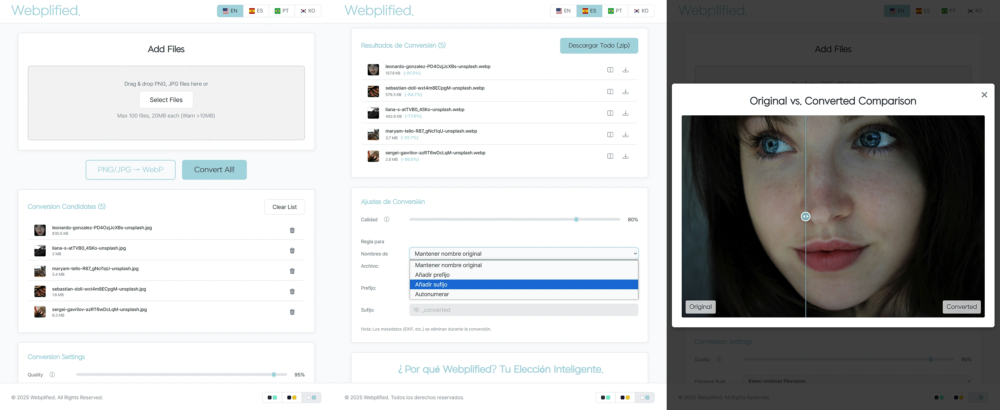

# Webplified. - The Fastest & Safest WebP Converter

**[➡️ Try it out live!](https://heavyrain39.github.io/Webplified/)**

**Webplified** is the most beautiful, fast, and secure image conversion tool that runs entirely in your browser. Stop uploading your potentially sensitive image files to a server. With Webplified, you can convert your PNG/JPG images to WebP, or vice versa, with 100% privacy.

---

### ✨ Core Features

*   🔒 **100% Private & Secure:** All conversion processes are handled right on your device (in your browser). Your precious files are never sent to or stored on any external servers.

*   🚀 **Blazing Fast Conversion:** By leveraging the Web Worker API for multi-threaded processing, it converts up to 100 files in a flash without any UI freezes. The days of waiting are over.

*   🔄 **Flawless Two-Way Conversion:** Not only does it convert PNG/JPG to WebP, but it also effortlessly reverts WebP back to PNG (preserving transparency) or JPG.

*   ✨ **Beautiful & Intuitive UI/UX:**
    *   Features three stunning color themes (Default, Cosmic Indigo, Aetherial Light) to suit your preference.
    *   Conveniently add files via drag & drop, and even reorder them in the list the same way.
    *   An intuitive image comparison slider to see the before-and-after results.

*   🗂️ **Powerful Batch Processing:**
    *   Process up to 100 files at once and download them all in a single compressed ZIP file.
    *   Provides handy filename rules, such as adding prefixes/suffixes or auto-numbering.

*   🌐 **Multi-language Support:** Available in English, Korean, Spanish, and Portuguese, making it accessible to users worldwide.

*   💸 **Completely Free:** No ads, no subscriptions. Use all features entirely for free.

---

### 🛠️ Tech Stack

*   **Front-end:** `HTML5`, `CSS3`, `JavaScript (ES6+ Modules)`
*   **Core Logic:**
    *   `Web Workers API`: Handles heavy image processing in the background to maximize UI performance and prevent freezes.
    *   `JSZip.js`: Creates a zip archive of converted files on the client-side for the "Download All" feature.
*   **Architecture:** **No Backend, No Frameworks.** A pure, lightweight, and fast vanilla JS application.

---

### ☕ Support This Project

Do you like Webplified? This service is a passion project, created and maintained by a solo developer.

If Webplified has saved you time or you found it useful, please consider supporting its continued development with a small donation—the price of a cup of coffee. Your support is a tremendous encouragement and helps keep the service running and improving.

**[Support me on Buy Me a Coffee](https://buymeacoffee.com/yakshawan)**
